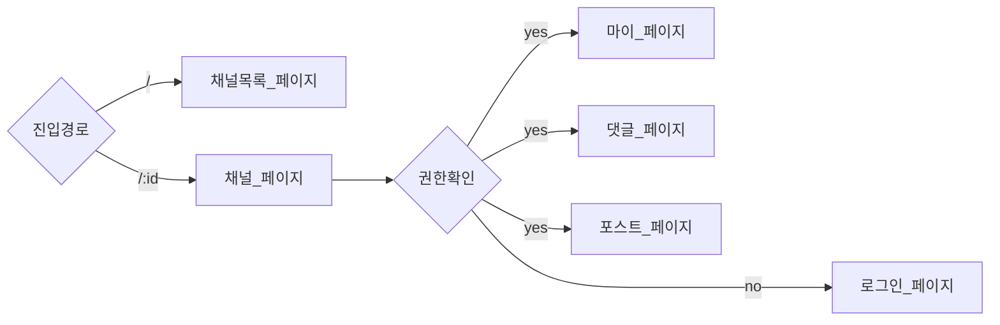
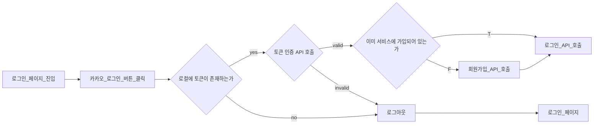

- FlowChart는 사용자의 행위와 결과에 대한 내용이어야 한다.
	- 즉, 어떤 페이지로 이동되냐가 아니다. 페이지 이동은 전반적인 설계 유추 어려움.

```mermaid

flowchart LR 
	진입경로{진입경로} --> |/|채널목록_페이지 
	진입경로 --> |/:id|채널_페이지 
	채널_페이지 --> 권한확인{권한확인} 
	권한확인 -->|yes|마이_페이지 
	권한확인 -->|yes|댓글_페이지 
	권한확인 -->|yes|포스트_페이지 
	권한확인 ---->|no|로그인_페이지
```

대충 kakaologin

```mermaid
flowchart LR 
로그인_페이지_진입 --> 카카오_로그인_버튼_클릭 
카카오_로그인_버튼_클릭 --> token{로컬에 토큰이 존재하는가} 
token -->|yes|token_api{토큰 인증 API 호출} 
token_api -->|valid|is_user{이미 서비스에 가입되어 있는가} 
token_api -->|invalid|로그아웃 
is_user -->|T|로그인_API_호출 
is_user -->|F|회원가입_API_호출 
회원가입_API_호출 --> 로그인_API_호출 
token -->|no|로그아웃 
로그아웃 --->로그인_페이지
```
이렇게 특정 페이지 이동한다는 개념에 얽매이지 말고 "행위"에 초점
- 로그인 시나리오
- 회원가입 시나리오
- 글 공유 시나리오

