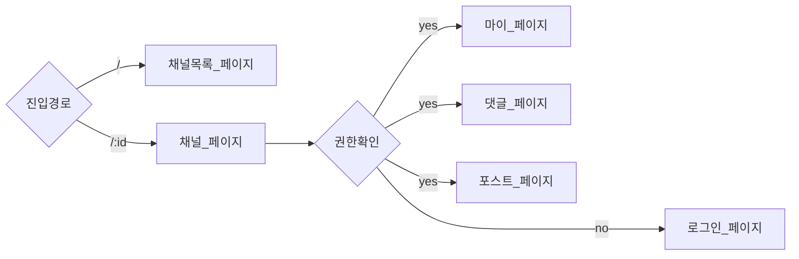
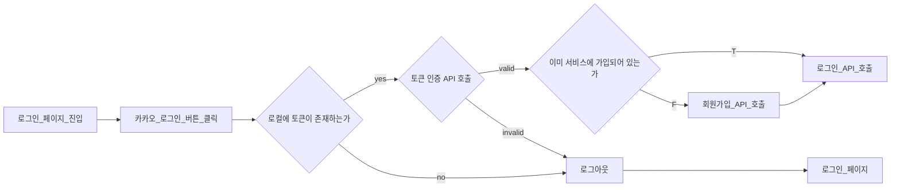

일단 취준생이라는 타게팅이 명확하고 서비스가 쉽게 이해되서 좋았습니다. 

주요 기능을 리스팅 하는 것보다는 말 그대로 이 서비스를 가장 잘 나타낼 수 있는 기능을 작성해주시면 좋을 것 같아요. 현재 작성된 방식은 면접 연습에 대한 방법, 질문 목록 조회 방법 과 같은 특정 기능의 스펙으로 보입니다. 스펙도 물론 작성해야 하지만 이 제품을 나타낼 수 있는 핵심 기능을 작성해주세요. 보통은 유저가 이 제품을 이용하는 시나리오를 작성하면 이해하기 쉽습니다. (참고 https://yozm.wishket.com/media/news/2213/6__User_story.png)
특히 혼터뷰는 인터뷰 프로세스를 거치는 것이 핵심 기능으로 보여집니다. 예컨대 사용자는 면접 연습을 할 수 있다의 플로우를 위 그림과 같이 작성해본다면, 질문을 선택한다 -> 답변을 작성한다 -> 꼬리 물기 질문이 시작된다. -> 답변한다(앞의 과정으로 순환 가능한 화살표) => 면접 완료 -> 결과를 확인할 수 있다. 와 같이 작성해볼 수 있을 것 같아요. (러프하게 작성한거라 참고만 부탁드려요.)

- MVP가 뭘지 고민해도 좋을 것 같다. 

- 유저 플로우 필요. 사용자의 행동을 나타낼 수 있는 시나리오. 이 시나리오는 이 제품을 가장 잘 나타낼 수 있는 시나리오여야함. 예를 들어,
- 핵심 기능 유저는 A를 할 수 있다. 

- PR단위는 작게

## 기술 스택
- 노션에 컨벤션, 환경변수 등을 작성해주셨는데.. 이런 문서들은 repo에 코드와 함께 유지보수 되는 걸 추천드립니다. 문서가 코드와 같이 함께 관리되지 않고 외부에 있다면 업데이트 되지 않고 버전이 맞지 않게 됩니다. 추가로 eslint, 환경변수와 같이 코드로 유지보수 될 수 있는 것들은 따로 문서를 작성하지 않고 저장소 내에서 git으로 관리되면 문서를 따로 업데이트 하지 않아도 되겠죠? git의 도움을 받아 왜 업데이트 됐는지 commit history를 뒤져보면 되구요 ㅎㅎ
- 폴더 구조는 커피챗 때 말씀 드린 것처럼 기능이 아닌 도메인에 포커스를 하여 수정해도 좋을 것 같습니다. (https://twitter.com/TkDodo/status/1749717832642736184)

- API 명세를 어떻게 관리할지는 모르겠지만 Swagger와 같은 오픈소스를 이용해도 좋을 것 같습니다. 더 나아가서 openapi 명세서를 받아서 codegen 라이브러리 (https://github.com/drwpow/openapi-typescript) 를 이용하여 TS로 자동생성 되는 프로세스를 구축해도 좋을 것 같습니다. (이건 한번 리서치 해보시고 백엔드 분들과 얘기 나눠보셔요!)

## 협업방식

- 초반에는 새로 추가한 라이브러리 세팅, 공용 컴포넌트 등의 작업이 많을 것 같다. PR은 가급적 하루 이상을 넘기지 않기를 바랍니다. PR이 오래될 수록 수정사항이 많아지거나 베이스 브랜치가 오래되어 리뷰하기 어렵거나 충돌이 나기 쉽다. 리뷰하기 어렵다면 스크럼 때 해당 PR을 리뷰하기 어렵다 혹은 해당 PR을 리뷰를 안해주셔서 다같이 보면서 리뷰하면 어떨까요? 와 같은 방법을 사용하여 빠르게 머지를 진행하는 것을 추천합니다. 
- PR단위는 가능한 작게, 코드를 작성할 때 SRP를 고려하실 텐데 PR도 이 원칙을 적용하면 빠른 코드리뷰와 머지가 이뤄질 것 같아요.

# [피드백] 최종 프로젝트 1차

<aside> 💡 피드백 날짜와 담당자에 본인 + Sophia 추가해 주세요. 해당 문서는 팀에게 공유될 예정이며, 커피챗 하면서 공유해 주셔도 됩니다.

</aside>

### 💻 프로젝트 컨셉 및 목표

1. 우리에게 이미 익숙한 타자연습 게임을 웹으로 구현하고 게임적인 요소를 녹여 아이스 브레이킹 서비스로 포지셔닝 하는 것은 제법 뾰족하다고 생각됩니다.
2. 다른 아이스 브레이킹 서비스 말고 우리 서비스를 써야하는 killing usecase가 어떤 것이 있을지 미리 생각해보면 좋을 것 같습니다(웹으로 타자연습을 할 수 있는 서비스가 있더라도 우리가 아이스 브레이킹으로 보통 타자 연습을 하자고 하지는 않죠. 그 이유는 뭘까요? 서비스가 있는지 몰라서? 있어도 발견하기가 어려워서? 그러면 그 문제는 어떻게 개선할 수 있을까요? 어떻게 하면 그런 상황에서도 우리 티키타자 서비스를 사용하게 할 수 있을까요?)
3. 게임의 규칙은 어느정도 기획이 된 것 같은데, 여기서 나아가 재미를 줄 수 있는 게임적 요소를 어떻게 가미할지, 다른 아이스 브레이킹 서비스에서는 어떤 재미 요소들이 녹여져 있는지를 파악하고 우리 서비스에 맞는 게이미피케이션 요소를 미리 정리해두면 좋겠습니다.
4. 우리 서비스가 많은 사용자들에게 사용되고 입소문을 타기 위해선 제 생각엔 기능을 정교하게 구현하는 것 보단 아이스 브레이킹으로 타자 연습 게임을 사용하기 위해 1) 우리가 해결해야 하는 문제는 무엇인지 정의하고 2) 그걸 디자인과 브랜딩으로 풀어내서 사용자로 하여금 ‘티키타자는 힙하네’ 이런 다른 서비스와 확연하게 다르단 인식을 심어주는 것이 좋겠습니다. 시중에 나와있는 타자연습 게임 수준의 기능을 모두 구현하는 것 보다는 기능은 최소로 구현하고 다른 서비스와의 차별화에 더 많은 시간과 노력을 쏟는 것이 좋을 것 같습니다.
    - 예를 들어 만약 위 2번에서 발견한 문제의 원인이 서비스 접근성이 낮기 때문이라면, 게임 방을 진짜 쉽게 만들 수 있게 해준다던지, 다른사람이 만든 방 링크만 있으면 진짜 쉽게 참여할 수 있도록 해준다던지 등을 생각해볼 수 있겠죠(트위터에 링크 던지기만 하면 사람들이 우루루 참여할 수 있게 한다던가 등).

### ✅ 프로젝트 구조 및 설계

- vanilla-extract 와 같이 별도 파일로 css를 작성해야 하는 css 프레임워크를 사용하시는게 아니라면 스타일은 컴포넌트 내부에 함께 작성해도 괜찮을 것 같습니다(컴포넌트와 스타일 코드를 별도 파일로 작성하면 두 파일을 번갈아 수정해야 하는 상황이 발생하기 때문에 번거로울 수 있는데, 별로 문제되지 않는다면 지금도 괜찮습니다).
- 인게임 route가 `/gameroom/:roomId?mode={게임모드}` 이렇게 되어있는데, URL에 `mode` search params를 유저가 직접 수정할 수 있기 때문에 URL로 표현하지 않는게 좋아보이네요. 그냥 roomId 까지만 있고 해당 페이지에서 roomId로 방 정보 조회 API를 호출해서 응답으로 mode를 가져오는게 좋아보입니다.
    - 인게임 종료화면은 `finish=true` 이런 search params가 붙어있는데 같은 맥락으로 유저가 직접 URL을 수정해서 종료화면으로 이동할 수 있으니 제거돼도 좋을 것 같아요.
    - 구글밋([https://meet.google.com](https://meet.google.com))의 URL을 참고해보셔요.
- API 명세서는 

### 🛠️ 기술 스택 및 협업툴

- 대부분은 지난 커피챗에서 구두로 말씀드려서 외에 내용만 추가로 전달드리면,
- 같은팀 BE 분들이 API 명세서를 지금은 노션에서 관리하고 계신 것 같은데, Swagger로 뽑아줄 수 있는지 얘기해보고, 가능하다면 openapi specification도 받아서 이를 통해 API 클라이언트 codegen 라이브러리(ex. [openapi-typescript](https://github.com/drwpow/openapi-typescript))를 사용해 자동으로 생성하는 것이 좋을 것 같습니다.
- Vite를 사용한다면 [https://github.com/hannoeru/vite-plugin-pages](https://github.com/hannoeru/vite-plugin-pages) 이런 플러그인을 사용해서 file system based routing을 구현할 수 있어요. React 와 react-router를 지원하니 사용해보셔도 좋을 것 같아요.
- Yarn classic(1.x 버전)은 4년전을 마지막으로 더 이상 메이저/마이너 업데이트가 이뤄지지 않고 있어요. 대신 Yarn berry라는 새로운 프로젝트에서 많은 업데이트가 이뤄지고 있죠(각종 플러그인, 워크스페이스 기능, CLI 등등). yarn을 사용한다면 yarn berry로 프로젝트를 관리하시는 것을 권장드려요.
- Tip) [Github CLI](https://cli.github.com/)를 사용하면 커맨드 라인에서 PR을 손쉽게 생성할 수 있어요.(ex. `gh pr create --base dev -d` 이렇게 하면 현재 내 브랜치에서 dev 브랜치로 향하는 PR을 draft로 생성해요!)

### 👥 협업 방식

- 특정 페이지나 기능 단위로 각자 역할을 나눠서 작업하는 것도 좋은데, 가능하다면 하나의 페이지 또는 기능을 두 사람이 페어프로그래밍 하는 것도 권장드려요. 이때 키보드를 잡는 사람과 네비게이터 역할을 해주는 사람을 번갈아 가면서 해요. 그러면 내가 코딩하면서 미처 보지 못한 부분을 다른 사람이 봐줄 수 있어서 도움이 될 거에요.
- 하나의 큰 PR을 올리기보다는 PR을 작게 쪼개서 여러번 나누어 올리는 것을 권장드려요([Stacked PR / Diff](https://newsletter.pragmaticengineer.com/p/stacked-diffs)). 그러면 코드리뷰 하는 사람 입장에서 부담도 덜하고 리뷰도 더 잘 할 수 있어요. 이때 git rebase 를 활용해서 커밋 히스토리도 이쁘게 관리하는 연습도 해보면 더 좋겠죠?

### 🗓️ 일정 산정 및 관리 방법

- 핵심 기능 구현이 2월 23일 까지로 되어있는데, 생각보다 시간이 많이 없어서 꼭 필요한 기능이 아니라면 적절하게 스펙아웃 하자는 용기있는 얘기도 적극적으로 주고받길 바래요.
- 혹시 구현 일정이 늦어질 것 같다면 미리 팀 내에 공유해주세요. 도움이 필요하면 저를 멘션해주셔도 좋아요. 같은 팀원들도 적극적으로 도와줄테니 이것도 용기있게 얘기해주시구요.

### 💡 기타

- 완성된 모습의 티키타자 서비스가 벌써 기대되네요. 데브코스 남은 기간 프로젝트에 온전히 집중해서 좋은 결과 만들어내길 바래요. 파이팅!

---
# [피드백] 팀 프로젝트 1차

<aside> 💡 피드백 날짜와 담당자에 본인 + Sophia 추가해 주세요. 해당 문서는 팀에게 공유될 예정이며, 커피챗 하면서 공유해 주셔도 됩니다.

</aside>

<aside> 💡 To. @Sophia 아래 문서에 추가적인 댓글을 통해 피드백을 달고 있읍니다. 해당 페이지들의 댓글에 소피아님 멘션도 달아놨으니 참고 부탁드려요! [회의록](https://www.notion.so/a53825c632d649759e78382736e08287?pvs=21)

- [기술 스택 선택 이유 공유](https://www.notion.so/0b31820b0d5c4d168327856f29b3498a?pvs=21)
- [기술 스택 & 디자인 픽스](https://www.notion.so/960c125530254476b49c2cf4ea616152?pvs=21)
- [공통개발 & api 관련](https://www.notion.so/api-0b21674b3f924fd3b1b23e2cb6be2603?pvs=21)

</aside>

### 💻 프로젝트 컨셉 및 목표

익명 편지 SNS 서비스라는 개념은 굉장히 신선하기도 하고 마침 연말이라 수요도 꽤 있을 것 같은 서비스네요.

서비스의 타겟 세그먼트는

- 떠나가는 사람에게 마음을 전하고 싶은 사람들
- 카톡이나 인스타로 대화를 주고 받기 부끄러운 사람들
- 평소 주변 동료에게 마음을 전하고 싶었던 사람들

총 3가지인데, 이때 이 세그먼트들은 조금씩 대화의 니즈가 다를 수 있을 것 같은데요.

- 떠나가는 사람에게 마음을 전하고 싶은 사람들
    - 대상 유저는 1명으로 고정되어있고, 나머지 N명의 인원이 메세지를 작성.
- 카톡이나 인스타로 대화를 주고 받기 부끄러운 사람들
    - 1:1 대화.
    - 불특정 다수를 대상으로 한 Public Message일 수도 있음. (ex. 경제학과 박OO! 나 사실 너…좋아해… 같은? 대나무숲 비슷한 느낌)
- 평소 주변 동료에게 마음을 전하고 싶었던 사람들
    - 첫번째 케이스와 반대로 대상 유저는 N명이고 메세지를 받아보는 대상 유저는 1명.
    - 또는 완전 불특정 다수를 타겟으로 한 Public Message (ex. 함께 해서 즐거웠고! 다시는 보지말자!)

즉, 메세지를 보낸다는 행위 자체는 모두 동일하지만, 각각의 상황에 따라 메세지를 작성하는 사람과 받아보는 사람의 인원이 다를 수 있다는 것이 기능 설계의 핵심일 것 같다는 생각이 듭니다.

이러한 상황들을 재미있게 풀어낼 수 있는 기능이 모두 포함된다면 좋겠지만, 시간이 한정적이기 때문에 **MVP를 만든다고 생각하고 일단 가장 중요한 하나의 컨셉에 집중**해보는 것도 좋을 것 같아요.

그리고 Google Analytics, Raw 데이터 등을 통해 실제로 사람들이 어떤 식으로 살펴보면 더더욱 재미있는 프로젝트가 될 것 같습니다.

### ✅ 프로젝트 구조 및 설계

피그잼을 통해 전반적인 Flow Chart를 잘 짜주셨는데요.

Flow Chart는 사용자의 행위와 결과에 대한 내용이어야 하는데, 현재는 행위보다는 “어떤 페이지로 이동되냐”에 더 초점이 맞춰져 있는 것 같습니다. 그래서 Flow Chart만 보고는 전반적인 설계에 대해 유추하기가 쉽지 않은 것 같습니다.

그래서

처럼 페이지 이동 중심의 개념에 더해, 아래와 같이 행위 위주의 Flow Chart도 있으면 좋을 것 같슴다. 이건 대충 Kakao Login 한다고 생각하고 그려본 차트에요.

이렇게 특정 페이지로 이동한다는 개념에 얽매이지 않고 전체적인 “행위”에 초점을 맞춰서 여러 개의 차트를 그려봐도 좋을 것 같습니다.

- 로그인 시나리오
- 회원가입 시나리오
- 글쓰기 시나리오
- 글 공유 시나리오
- 글 조회 시나리오
- 등…

### 🛠️ 기술 스택 및 협업툴

- Emotion
    - 선택 사유에 “MUI”에 대한 내용이 포함되어있는데, Emotion에 대한 선택 사유라면 Emotion 자체에만 집중해서 근거를 찾아보는 것이 좋을 것 같다.
        - 그리고 MUI는 내부적으로 자체 스타일 라이브러리를 가지고 있어서 Third-Party랑은 딱히 관련없지 않나…? 싶슴다.
    - 만약 “A(MUI)에서 쓰기 때문에 B(Emotion)를 사용했어요” 라는 논리라면 이는 여러가지 추가적인 의문을 들게 만들 수 있음.
        - B 자체만으로도 충분한 Benefit이 있는가? 있다고 하면 괜찮겠지만, 만약 애매하거나 명백히 좋지 않다면 이러한 B를 강제하고 있는 A에 대한 선택도 다시 고려해봐야 할 수 있음.
        - MUI는 다른 Third-Party Style Library들을 함께 사용하는 방법을 [공식문서](https://mui.com/material-ui/guides/interoperability)에 적어두었다. 그 말인 즉슨, emotion이 아니라 다른 방법을 선택해도 된다는 의미이며, 더 이상 MUI 때문에 Emotion을 써야한다는 논리는 참이 아니게 되어버림 🥲

### 👥 협업 방식

### 🗓️ 일정 산정 및 관리 방법

### 💡 기타